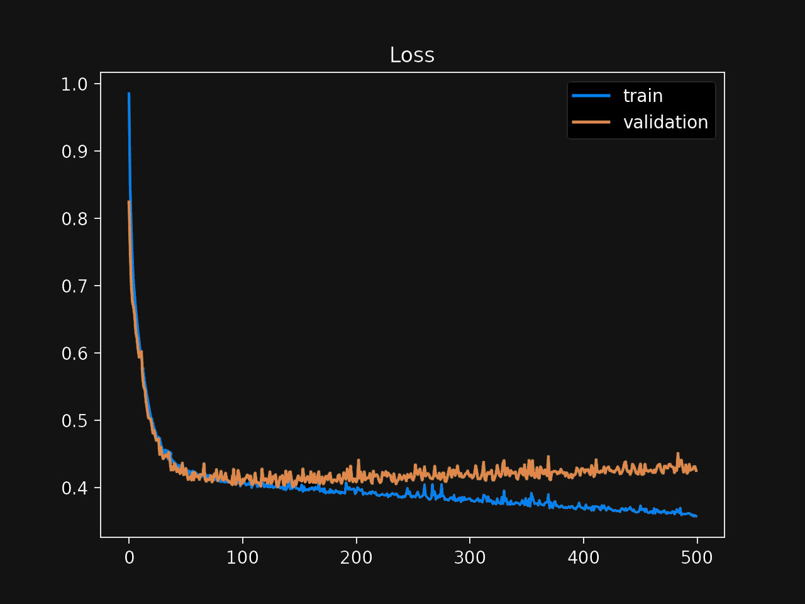

# Abigail's chart

Abigail firmly believes in charts. She always takes a few minutes to plot and support her story with compelling visuals.

She was ready to share her model with the rest of her team. This was her first machine learning experience, and she was proud of how much progress she had made in the last few weeks.

Abigail plotted her model's training and validation loss over the number of iterations (epochs). The cart looked like this:

Which of the following is the correct conclusion from looking at Abigail's plot?  

1. The training loss decreases continuously, indicating that the model is doing well.  
2. The validation loss decreases to a point and starts increasing again, indicating the model is overfitting.  
3. The training and validation loss suddenly slowed down, indicating a problem with the learning process.  
4. The validation loss doesn't follow the training loss closely, indicating the model is underfitting.  

### Answer
:::{.callout-note collapse="true" appearance="minimal"}
## Expand to see the answer

2.

Analyzing learning curves is one of the fundamental skills you should build in your career. There are different learning curves, but we will focus on Abigail's chart.

First, notice that the chart shows the loss—or error—as we increase the number of training iterations. A good mental model is to look at this the following way: "as we keep training, how much better the model gets?" Since we are displaying the loss, larger values are worse, so having both lines decrease is a good sign.

We have two lines in the chart: one representing the loss we get during training, the other representing the loss during the validation process. How these lines look concerning each other is essential. Most of the time, one of the lines alone wouldn't give you a complete picture of the situation.

Let's start with the first choice that argues that a training loss that's continually decreasing is good. Indeed this could be a good sign in isolation: the more we train our model, the fewer mistakes we make on the training dataset, but this is not enough to draw any conclusions.

Always be suspicious of an always-decreasing training loss; it's a sign that your model might be memorizing the data. Usually, you want a model that learns up to a point, and then the loss stays flat. But how do you know when during the process that should happen? The relationship between the training loss and the validation loss shows how they start diverging at about 100 iterations. This point is the key.

Think about it this way: Abigail's model "continues learning" the training data but stops learning the validation data at about 100 iterations. The model is overfitting: it's memorizing the training data, which is not helping with the validation data. Therefore, the first choice is incorrect, and the second is correct.

The third choice is incorrect as well. You'll always see a similar slow down in the loss functions. The best case—not usual, but technically possible—is to reach 0, where there's nowhere else to go.

Finally, the fourth choice is also incorrect. First, the training and validation loss do not necessarily need to follow each other. Second, this model shows overfitting—memorizing the training data—and not underfitting—lack of model complexity to learn the data correctly. You can usually identify an underfitting model when its training loss is flat or doesn't decrease much.

In summary, the second choice is the correct answer to this question.

#### Recommended reading

* ["How to use Learning Curves to Diagnose Machine Learning Model Performance"](https://machinelearningmastery.com/learning-curves-for-diagnosing-machine-learning-model-performance/) is the article that inspired this question and from where I borrowed Abigail's chart.
    Wikipedia's introduction to [Learning curves](https://en.wikipedia.org/wiki/Learning_curve_(machine_learning)).
:::
