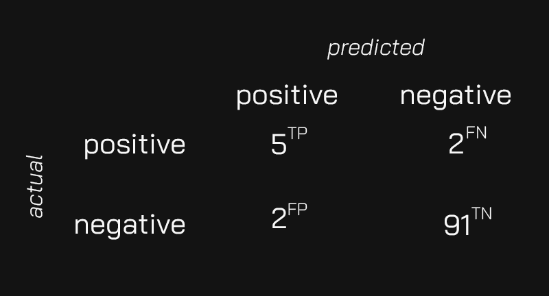

Mariam built a machine learning model that looks at pictures of mechanical components and predicts whether they need maintenance.

After successfully testing the model in a pilot project, the company plans to start using it in one of its warehouses. Before they are ready, Miriam needs to summarize the performance of the pilot project.

She ran pictures of 100 different components through the model and found the following:

* The model predicted that 7 components needed maintenance. After manually inspecting them, only 5 required work, but the other 2 were okay.
* The model predicted that 93 components were working as expected but missed 2 that needed maintenance.

Which of the following is the correct summary of accuracy, precision, and recall for Miriam's model?

1. The model's accuracy is 93%, the precision is 29%, and the recall is 71%.

2. The model's accuracy is 98%, the precision is 71%, and the recall is 29%.

3. The model's accuracy is 90%, the precision is 98%, and the recall is 29%.

4. The model's accuracy is 96%, the precision is 71%, and the recall is 71%.

:::{.callout-note collapse="true" appearance="minimal"}
## Expand to see the answer

4

The easiest way to answer this question is to put the information we know in a [confusion matrix](https://en.wikipedia.org/wiki/Confusion_matrix). Whenever you build a classification model, the confusion matrix will help tremendously. Let's see how.

Here is the confusion matrix with Miriam's results. Notice the small annotations next to each value:



* Miriam's model found 5 true positives (TP). These are the components that the model predicted that needed maintenance that actually needed it.
* There are 2 false positives (FP). These are the other 2 components the model thought erroneously needed maintenance.
* There are 91 true negatives (TN). These are the components the model classified as okay and were indeed fine.
* There are 2 false negatives (FN). These are the 2 components that the model missed as needing maintenance.

We can compute the three metrics we need using this information. Let's start with accuracy:

```
accuracy = (TP+TN)/(TP+TN+FP+FN)
accuracy = (5+91)/(5+91+2+2)
accuracy = 96/100
accuracy = 0.96
```

The [precision](https://en.wikipedia.org/wiki/Precision_and_recall#Precision) of the model is the fraction of components that truly need maintenance among the components that the model predicts need it. We can compute the precision this way:

```
precision = TP/(TP + FP)
precision = 5/(5 + 2)
precision = 5/7
precision = 0.71
```

The [recall](https://en.wikipedia.org/wiki/Precision_and_recall#Recall) of the model is the fraction of components that truly need maintenance among all the existing components that need maintenance. We can compute the recall this way:

```
recall = TP/(TP + FN)
recall = 5/(5 + 2)
recall = 5/7
recall = 0.71
```

As you can see, the fourth choice is the correct answer to this question.

**Recommended reading**

* Here is the Wikipedia page explaining what a [confusion matrix](https://en.wikipedia.org/wiki/Confusion_matrix) is. Most of the information you need is here.
* Check out ["Precision and recall"](https://en.wikipedia.org/wiki/Precision_and_recall) for a better understanding of these two metrics.
* ["Evaluating Deep Learning Models: The Confusion Matrix, Accuracy, Precision, and Recall"](https://blog.paperspace.com/deep-learning-metrics-precision-recall-accuracy/) is a great article that puts all of these concepts together.
:::
