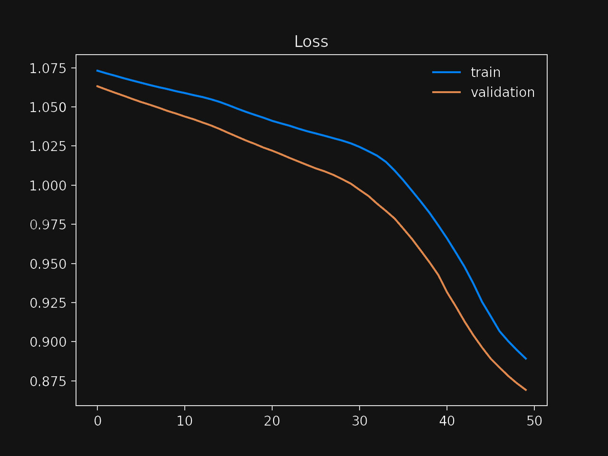

Ayla is grading the first exam of her machine learning class.

Almost 50 students submitted a document explaining the neural network architecture they used to solve a problem and a complete analysis of their results.

Ayla opens the first paper and sees the following chart, showing the model's training and validation loss over the number of iterations (epochs):

Which of the following is the correct feedback Ayla should give this student?

1. The training loss decreases continuously, indicating that the model is doing well.

2. The separation between the training and the validation curves indicates the training set is too complex for the model to learn.

3. The training and validation loss continue to decrease until the end of the training process, indicating the model is overfitting.

4. The training and validation loss continue to decrease until the end of the training process, indicating the model is underfitting.

:::{.callout-note collapse="true" appearance="minimal"}
## Expand to see the answer

4

Analyzing [learning curves](https://en.wikipedia.org/wiki/Learning_curve_(machine_learning)) is one of the fundamental skills you should build in your career. There are different learning curves, but we will focus on Ayla's chart here.

First, notice that the chart shows the loss—or error—as we increase the number of training iterations. A good mental model is to look at this the following way: "as we keep training, how much better the model gets?" Since we are displaying the loss, larger values are worse, so having both lines decrease is a good sign.

We have two lines in the chart: one representing the loss we get during training, the other representing the loss during the validation process. How these lines look concerning each other is essential. Most of the time, one of the lines alone wouldn't give you a complete picture of the situation.

Let's start with the first choice that argues that a training loss that's continually decreasing means that Ayla's model is doing a good job. While this could be a good sign, it's not a sufficient explanation to draw any conclusions about the quality of the model. For example, the model could be memorizing the dataset (overfitting), and while the training loss is decreasing, we will end up with a flawed model. Therefore, the first choice is incorrect.

The chart shows a gap between the training and the validation loss. Even when the student didn't train the model for too long (about 50 epochs), the gap indicates the model can achieve a better loss in the validation dataset. This, however, doesn't mean the training dataset is too complex for the model to learn. The chart shows how the training loss continually decreases until the end of the process, so the second choice is also incorrect.

The critical insight is that the training and validation losses decrease during the entire process. What would you say if you were to guess what would happen right after the 50th epoch? Looking at the chart, it seems clear that both the training and validation losses have the potential to keep decreasing, and therefore the student stopped the training process too early.

What does this mean? Is the model overfitting or underfitting?

The model is not maximizing its potential. If we let it train for longer, the model will likely continue learning. This is a characteristic of underfitting models: they aren't taking full advantage of their data. Therefore, the third choice is incorrect, and the fourth is the correct answer to this question.

**Recommended reading**

* ["How to use Learning Curves to Diagnose Machine Learning Model Performance"](https://machinelearningmastery.com/learning-curves-for-diagnosing-machine-learning-model-performance/) is the article that inspired this question and from where I borrowed Ayla's chart.
* Wikipedia's introduction to [Learning curves](https://en.wikipedia.org/wiki/Learning_curve_(machine_learning)).
:::
