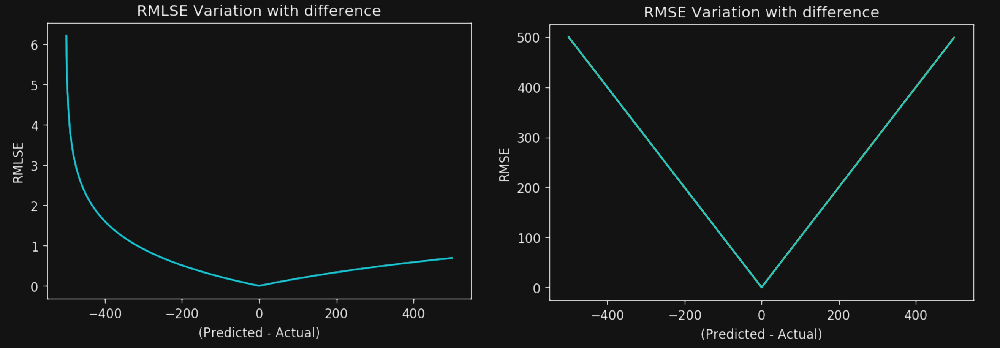

Sam owns a small store that sells vintage shoes.

Business is going great, and one of her main issues is determining the price of new inventory as it comes in. Sam would like to create a machine learning model that automatically selects the best price using the historical performance.

Sam was a data scientist in a previous life, so she was surprised when she found some documentation recommending a new loss function: The Root Mean Squared Log Error (RMSLE.) This function seemed better than Root Mean Squared Error (RMSE) for her use case.

Which of the following are some of the differences between RMSLE and RMSE?

1. RMSLE penalizes coming under the actual value much more than coming above the actual value. On the other hand, RMSE penalizes both cases in the same way.

2. RMSLE is not sensitive to outliers as RMSE is. Whenever we have outliers, the result of RMSE can explode while RMSLE will scale down the outliers.

3. RMSLE measures the error by only focusing on the predicted value. On the other hand, RMSE uses the difference between the predicted and the actual value to compute the error.

4. RMSLE focuses on the relative error between two values. When using RMSLE, the scale of the error is not significant. On the other hand, the result of RMSE increases in magnitude if the error scale increases.

:::{.callout-note collapse="true" appearance="minimal"}
## Expand to see the answer

1, 2, 4

Compared to [RMSE](https://en.wikipedia.org/wiki/Root-mean-square_deviation), [RMSLE](https://peltarion.com/knowledge-center/documentation/modeling-view/build-an-ai-model/loss-functions/mean-squared-logarithmic-error-(msle)) is a relatively new metric. Here is the formula:

$$
\sqrt{ \frac{1}{n} \sum_{i=1}^n (\log(x_i + 1) - \log(y_i + 1))^2 }
$$

If you compare this formula with the RMSE formula, you'll notice they are almost the same, with the difference of RMSLE computing the log of both the predicted and actual values. This small difference comes with some essential properties.

First, RMSLE penalizes underestimates much more than overestimates. To understand the reason, take a look at the following charts that I took from ["What's the Difference Between RMSE and RMSLE?"](https://medium.com/analytics-vidhya/root-mean-square-log-error-rmse-vs-rmlse-935c6cc1802a):

Notice how RMSLE penalizes negative values much more heavily than positive ones, while RMSE equally penalizes both cases. Therefore, the first choice is correct.

The second choice is also correct. The log that RMSLE uses squashes outliers, while RMSE amplifies their effect. If you want your model to remain unaffected by outliers, RMSLE is a good candidate.

The third choice is incorrect because both RMSE and RMSLE use the predicted and actual values. Predicted values alone don't tell us anything; comparing them with the actual value is critical.

Finally, the fourth choice is also correct. For example, imagine a case where the model predicts 30 when the actual value was 40 and another case where the prediction was 300 when the actual value was 400. The RMSE of the second case is ten times more than the RMSE of the first case. However, the RMSLE will score both cases the same. The RMSLE measures the relative error, while the RMSE measures the absolute error.

In summary, the first, second, and fourth choices are correct.

**Recommended reading**

* ["What's the Difference Between RMSE and RMSLE?"](https://medium.com/analytics-vidhya/root-mean-square-log-error-rmse-vs-rmlse-935c6cc1802a) covers really well every one of the differences between these two functions.
* Another article that covers the differences between some of the most popular functions is ["Evaluation Metrics for Regression models"](https://akhilendra.com/evaluation-metrics-regression-mae-mse-rmse-rmsle/)
:::
