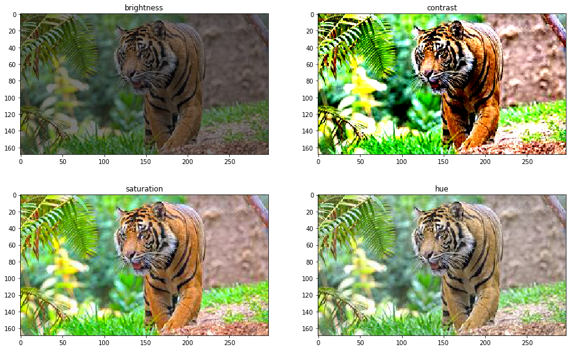

Esther had an excellent model already, but she had the budget to experiment a bit more and improve its results.

She was building a deep network to classify pictures. From the beginning, her Achilles' heel has been the size of her dataset. One of her teammates recommended she use a few data augmentation techniques.

Esther was all-in. Although she wasn't sure about the advantages of data augmentation, she was willing to do some research and start using it.

Which of the following statements about data augmentation are true?

1. Esther can use data augmentation to expand her training dataset and assist her model in extracting and learning features regardless of their position, size, rotation, etc.

2. Esther can use data augmentation to expand the test dataset, have the model predict the original image plus each copy, and return an ensemble of those predictions.

3. Esther will benefit from the ability of data augmentation to act as a regularizer and help reduce overfitting.

4. Esther has to be careful because data augmentation will reduce the ability of her model to generalize to unseen images.

:::{.callout-note collapse="true" appearance="minimal"}
## Expand to see the answer

1, 2, 3

One significant advantage of data augmentation is its ability to make a model resilient to variations in the data. For example, assuming we are working with images, we can use data augmentation to generate synthetic copies of each picture and help the model learn features regardless of where and how they appear.

A few popular augmentation techniques when working with images are small rotations, horizontal and vertical flipping, turning the picture to grayscale, or cropping the image at different scales. The [following example](https://www.v7labs.com/blog/data-augmentation-guide) shows four versions of an image generated by changing the original picture's brightness, contrast, saturation, and hue:

Data augmentation is also helpful during testing time: Test-Time Augmentation is a technique where we augment samples before running them through a model, then average the prediction results. Test-Time Augmentation often results in better predictive performance.

Instead of predicting an individual sample from the test set, we can augment it and run each copy through the model. Esther is working on a classification problem, so her model will output a softmax vector for each sample. She can then average all these vectors and use the result to choose the correct class representing the original sample.

Using data augmentation, Esther can reduce overfitting and help her model perform better on unseen data. Data augmentation has a regularization effect. Increasing the training data through data augmentation decreases the model's variance and, in turn, increases the model's generalization ability. Therefore, the third choice is correct, but the fourth one is not.

**Recommended reading**

* ["The Essential Guide to Data Augmentation in Deep Learning"](https://www.v7labs.com/blog/data-augmentation-guidej) is an excellent article discussing data augmentation in detail.
* Check ["Test-Time augmentation"](https://articles.bnomial.com/test-time-augmentation) for an introduction that will help you make better predictions with your machine learning model.
:::
