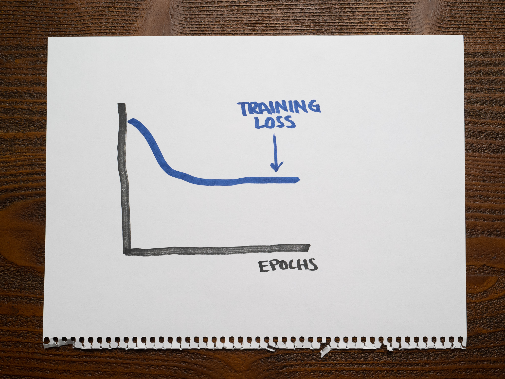

There's not a lot of context for you other than the following chart showing the training loss of a machine learning model:

As you can see, after finishing training, the loss stays too high.

What's a reasonable conclusion about this machine learning model?

1. The model is overfitting.

2. The model is underfitting.

3. The model is neither overfitting nor underfitting.

4. The model is either overfitting or underfitting, but we can't say for sure.

:::{.callout-note collapse="true" appearance="minimal"}
## Expand to see the answer

2

A good model should capture valuable patterns in the data and discard any noise that doesn't help with predictions. An overfitting model will fit that noise. An underfitting model will not capture the relevant patterns in the dataset.

An overfitting model should not have any problems with the training data, so we should expect a low training loss. An underfitting model should struggle with the training data, so its training loss will be high.

This model shows a high training loss, which we expect for an underfitting model.

**Recommended reading**

* Check ["Overfitting and Underfitting with Learning Curves"](https://articles.bnomial.com/overfitting-underfitting-learning-curves) for an introduction to two fundamental concepts in machine learning through the lens of learning curves.
:::
