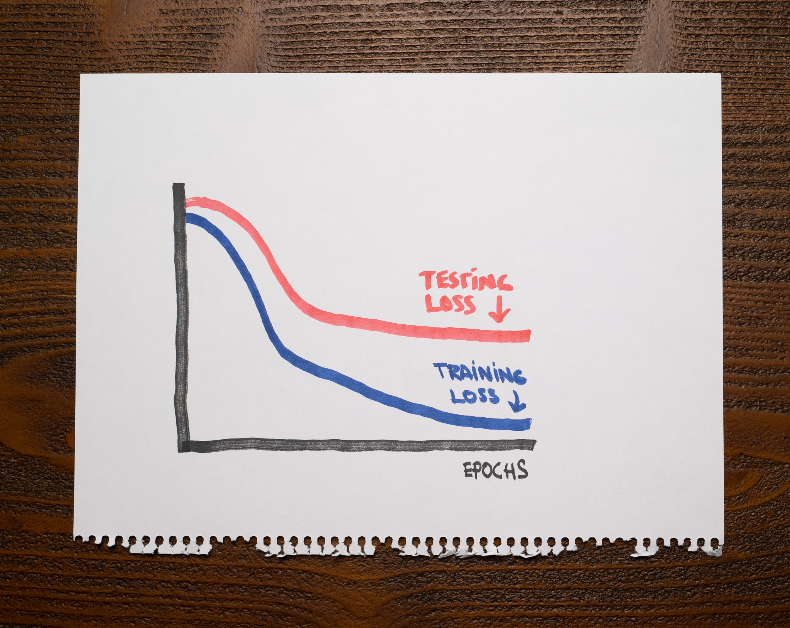

There's not a lot of context for you other than the following chart showing the training and testing losses of a machine learning model:

As you can see, after finishing training, both losses decreased nicely, but there's a large gap between the training and the testing curves.

What's a reasonable conclusion about this machine learning model?

1. This model is underfitting.

2. This model is well-fit.

3. The training dataset is not sufficiently large.

4. The training and testing datasets are different enough for the model to struggle to solve testing samples.

:::{.callout-note collapse="true" appearance="minimal"}
## Expand to see the answer

3, 4

A good model should capture valuable patterns in the data and discard any noise that doesn't help with predictions. An overfitting model will fit that noise. An underfitting model will not capture the relevant patterns in the dataset.

An overfitting model should not have any problems with the training data but stumble with the testing data. Therefore, we should expect a low training loss and a high testing loss. An underfitting model should struggle with the training and testing datasets, so both of its losses should be high. A well-fit model, however, should have low training and testing losses.

The chart shows a model that, while making progress, can't entirely solve the testing dataset. This happens whenever the training data is insufficient to train a model that performs well on unseen data.

For example, the training and the testing data might differ enough that the model can't get many of the testing samples correct, or the training dataset might not be large enough.

**Recommended reading**

* Check ["Overfitting and Underfitting with Learning Curves"](https://articles.bnomial.com/overfitting-underfitting-learning-curves) for an introduction to two fundamental concepts in machine learning through the lens of learning curves.
:::
