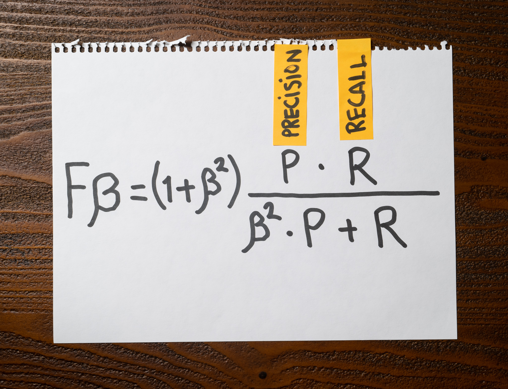

Hadley is building a multi-class classification model to separate coffee beans into five categories.

To measure the model's efficacy, Hadley decided to use the F1-Score.

But there's one problem: Hadley knows how to compute the F1-Score for every class separately, but she needs a single F1-Score value to compare different model versions and choose the best one.

Select from the following list every metric that Hadley can use to summarize the F1-Score for her model?

1. Hadley can compute the Macro-average F1-Score.

2. Hadley can compute the Micro-average F1-Score.

3. Hadley can compute the ROC F1-Score.

4. Hadley can compute the Weighted F1-Score.

:::{.callout-note collapse="true" appearance="minimal"}
## Expand to see the answer

1, 2, 4

When building a classification model, the precision and recall scores are two metrics that indicate how effective the model is. There's a trade-off between these metrics, so higher precision models sacrifice recall and vice versa.

It's hard to compare classifiers unless we have a single metric that summarizes the balance between precision and recall. The Fβ score lets us do that.

When using β = 1, we place equal weight on precision and recall. For values of β > 1, recall is weighted higher than precision; for values of β < 1, precision is weighted higher than recall. F1-Score is the most commonly used, which is the Fβ score with β = 1.

Computing the F1-Score for each class in a multi-class classification problem is simple: F1-Score = 2 × (precision × recall) / (precision + recall), but this leads to the problem Hadley is facing: How can she combine the individual F1-score values into a single F1-Score value?

The Macro-average F1-Score is one approach where we calculate the F1-Score for each category and then average all the results. This method penalizes the model equally for any class that doesn't perform well, regardless of its importance or how many support samples it has.

The Micro-average F1-Score is another approach where we sum all of the contributions from each category to compute an aggregated F1-Score. In this case, we don't use the individual F1-Scores but the overall precision and recall across all samples. This method doesn't favor or penalize any class in particular.

Finally, the Weighted F1-Score is another way of computing a global F1-Score. In this approach, we weigh every individual F1-Score using the number of true labels of each class and then sum them to produce the global F1-Score. This method favors the majority classes because they will be weighted more in the computation.

The ROC F1-Score is a made-up term and therefore is not correct.

**Recommended reading**

* ["Micro, Macro & Weighted Averages of F1 Score, Clearly Explained"](https://towardsdatascience.com/micro-macro-weighted-averages-of-f1-score-clearly-explained-b603420b292f) is a great article covering how to compute a global F1-Score metric in multi-class classification problem.
* Check ["When accuracy doesn't help"](https://articles.bnomial.com/when-accuracy-doesnt-help) for an introduction to precision, recall, and f1-score metrics to measure a machine learning model's performance.
* Check ["Confusion Matrix"](https://articles.bnomial.com/confusion-matrix) for a full explanation of how a confusion matrix works and how you can use them as part of your work.
:::
