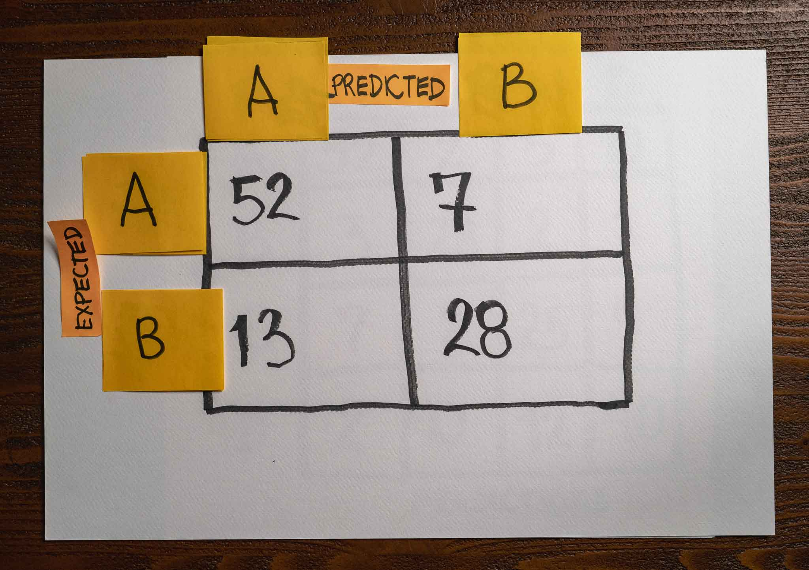

A team built a binary classification model. They named the classes A and B.

After finishing training, they evaluated the model on a validation set, and here is the confusion matrix with the results:



Given the above confusion matrix, what of the following correctly represents the model's recall predicting classes A and B, respectively?

1. The model's recall predicting class A is 80%, and class B is 80%.

2. The model's recall predicting class A is 88%, and class B is 68%.

3. The model's recall predicting class A is 88%, and class B is 88%.

4. The model's recall predicting class A is 68%, and class B is 88%.

:::{.callout-note collapse="true" appearance="minimal"}
## Expand to see the answer

2

To compute the model's recall, we can use the following formula:
```
recall = TP / (TP + FN)
```

Let's start with class A. We have 52 true positive samples and 7 false negatives in this example. Substituting these values in our formula:

```
recall = TP / (TP + FN)
recall = 52 / (52 + 7)
recall = 52 / 59
recall = 0.88
```

Therefore, the model's recall at predicting class A is 88%.

We can now look at class B. We have 28 true positive samples and 13 false negatives in this example. Substituting these values in our formula:

```
recall = TP / (TP + FN)
recall = 28 / (28 + 13)
recall = 28 / 41
recall = 0.68
```

Therefore, the model's recall at predicting class B is 68%.

**Recommended reading**

* Check ["When accuracy doesn't help"](https://articles.bnomial.com/when-accuracy-doesnt-help) for an introduction to precision, recall, and f1-score metrics to measure a machine learning model's performance.
* Check ["Confusion Matrix"](https://articles.bnomial.com/confusion-matrix) for a full explanation of how a confusion matrix works and how you can use them as part of your work.
:::
