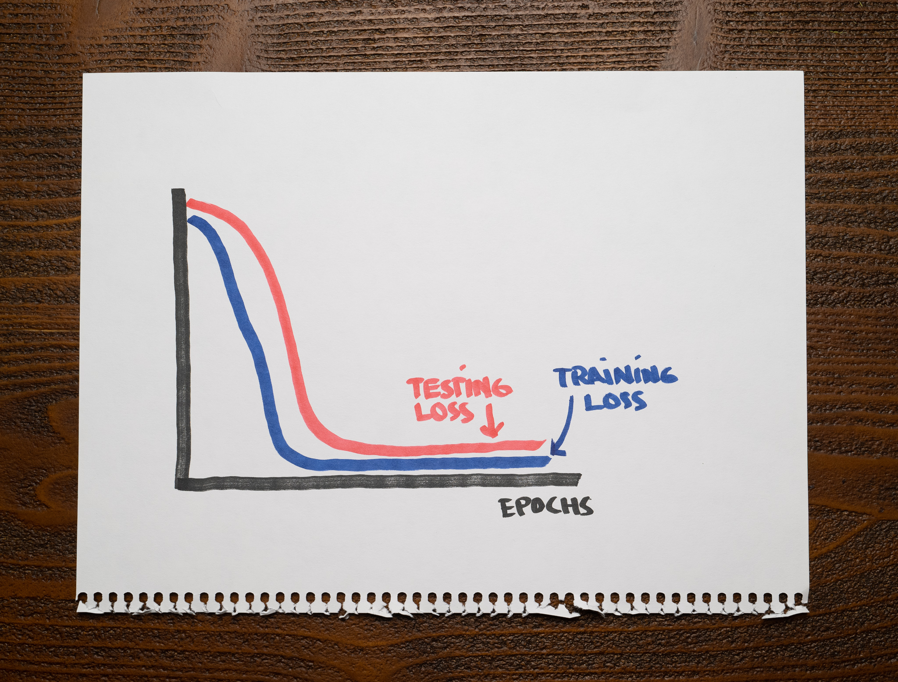

There's not a lot of context for you other than the following chart showing the training and testing losses of a machine learning model:

As you can see, after finishing training, both losses are low.

What's a reasonable conclusion about this machine learning model?

1. Your model is overfitting.

2. Your model is underfitting.

3. Your model is either overfitting or underfitting, but we can't tell.

4. Your model is well-fit.

:::{.callout-note collapse="true" appearance="minimal"}
## Expand to see the answer

4

A good model should capture valuable patterns in the data and discard any noise that doesn't help with predictions. An overfitting model will fit that noise. An underfitting model will not capture the relevant patterns in the dataset.

An overfitting model should not have any problems with the training data but stumble with the testing data. Therefore, we should expect a low training loss and a high testing loss. An underfitting model should struggle with the training and testing datasets, so both of its losses should be high.

A well-fit model, however, should have low training and testing losses, which is what we see in the chart.

**Recommended reading**

* Check ["Overfitting and Underfitting with Learning Curves"](https://articles.bnomial.com/overfitting-underfitting-learning-curves) for an introduction to two fundamental concepts in machine learning through the lens of learning curves.
:::
