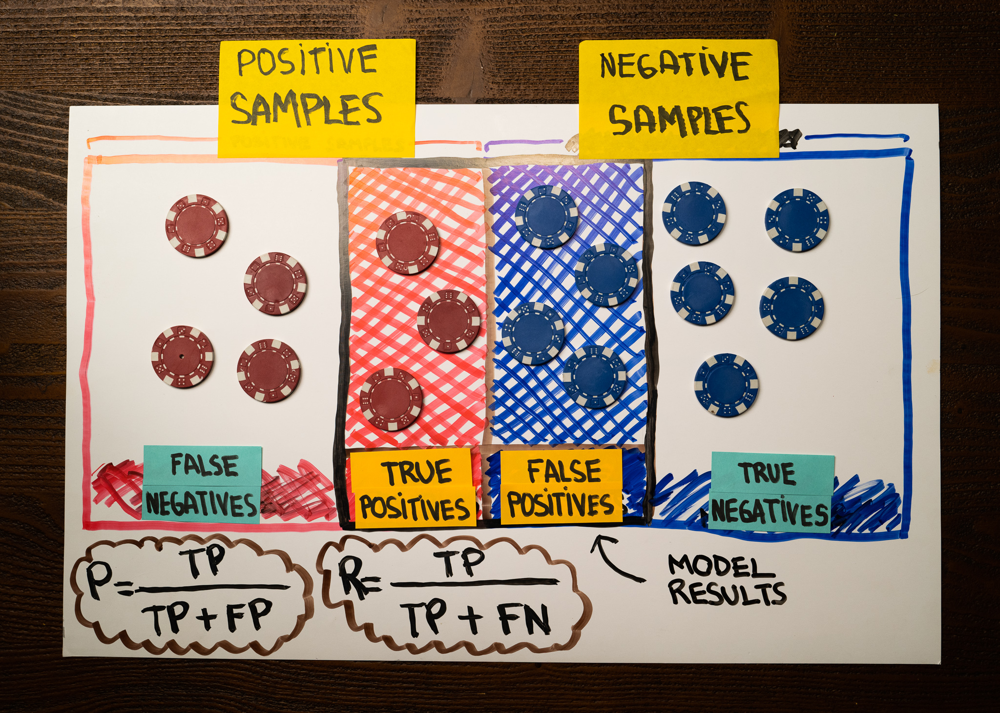
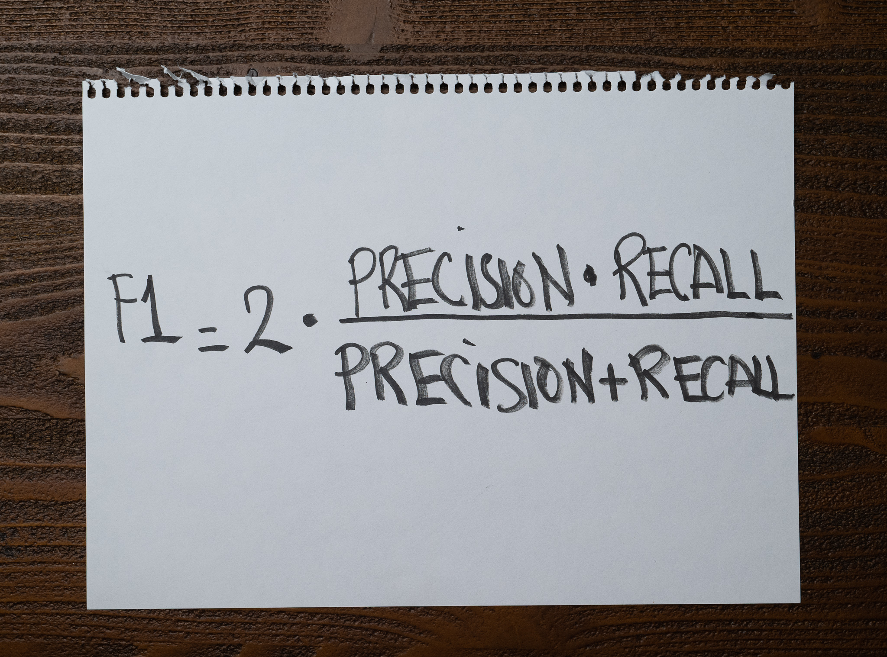

Logan works in the quality department of a beer factory.

She is responsible for maintaining several machine learning models that the factory uses to research and develop new drinks and containers.

While evaluating a new process, Logan put together the following table to show her manager the results. The red chips correspond to defective containers, and the model's results are those within the black lines at the center:

Which of the following is the correct f1-score of this model?

1. The f1-score of Logan's model is 43%.

2. The f1-score of Logan's model is 50%.

3. The f1-score of Logan's model is 86%.

4. The f1-score of Logan's model is 100%.

:::{.callout-note collapse="true" appearance="minimal"}
## Expand to see the answer

1

The model's f1-score is the harmonic mean between precision and recall. We can use the following formula to compute it:

Both the precision and recall of this model are 43%. Substituting this value in the previous formula, we get that the f1-score of Logan's model is also 43%.

**Recommended reading**

* Check ["When accuracy doesn't help"](https://articles.bnomial.com/when-accuracy-doesnt-help) for an introduction to precision, recall, and f1-score metrics to measure a machine learning model's performance.
* Check ["Confusion Matrix"](https://articles.bnomial.com/confusion-matrix) for a full explanation of how a confusion matrix works and how you can use them as part of your work.
:::
