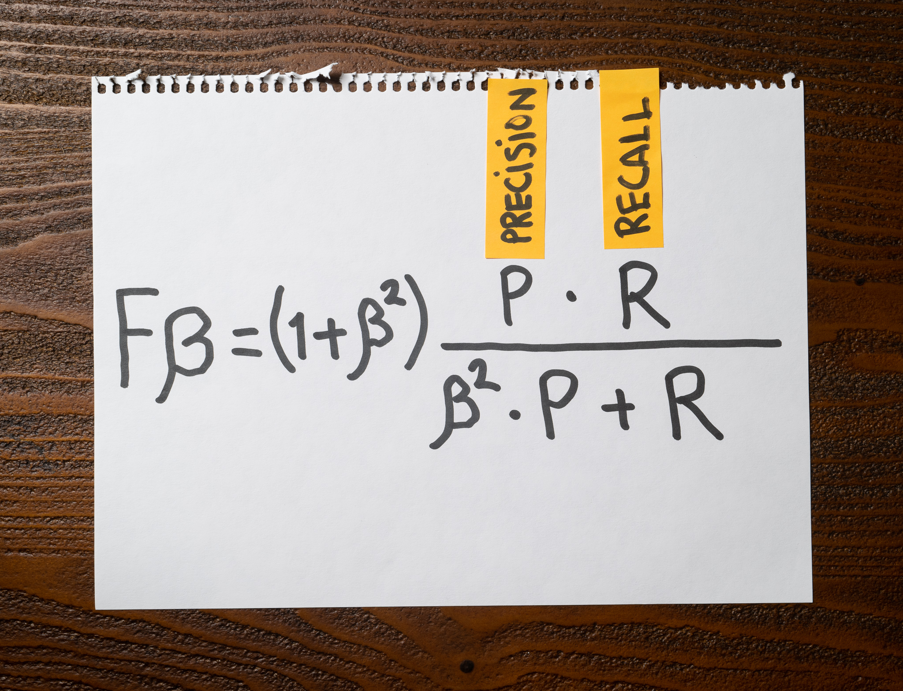

Here is the Fβ score formula:

The Fβ score lets us combine precision and recall into a single metric.

Let's say you want to use this formula to measure a model where higher precision is more important.

What's the correct value for the β parameter to achieve this?

1. β = 0

2. β = 0.5

3. β = 1

4. β = 2

:::{.callout-note collapse="true" appearance="minimal"}
## Expand to see the answer

1, 2

The Fβ score lets us combine precision and recall into a single metric. When using β = 1, we place equal weight on precision and recall. For values of β > 1, recall is weighted higher than precision; for values of β < 1, precision is weighted higher than recall.

When β = 0, the Fβ score only takes precision into account; therefore, the correct answers to this question are β = 0 and β = 0.5.

**Recommended reading**

* ["What is the F-Score?"](https://deepai.org/machine-learning-glossary-and-terms/f-score) is a short introduction to this metric.
* ["Micro, Macro & Weighted Averages of F1 Score, Clearly Explained"](https://towardsdatascience.com/micro-macro-weighted-averages-of-f1-score-clearly-explained-b603420b292f) is a great article covering how to compute a global F1-Score metric in multi-class classification problem.
* Check ["When accuracy doesn't help"](https://articles.bnomial.com/when-accuracy-doesnt-help) for an introduction to precision, recall, and f1-score metrics to measure a machine learning model's performance.
:::
