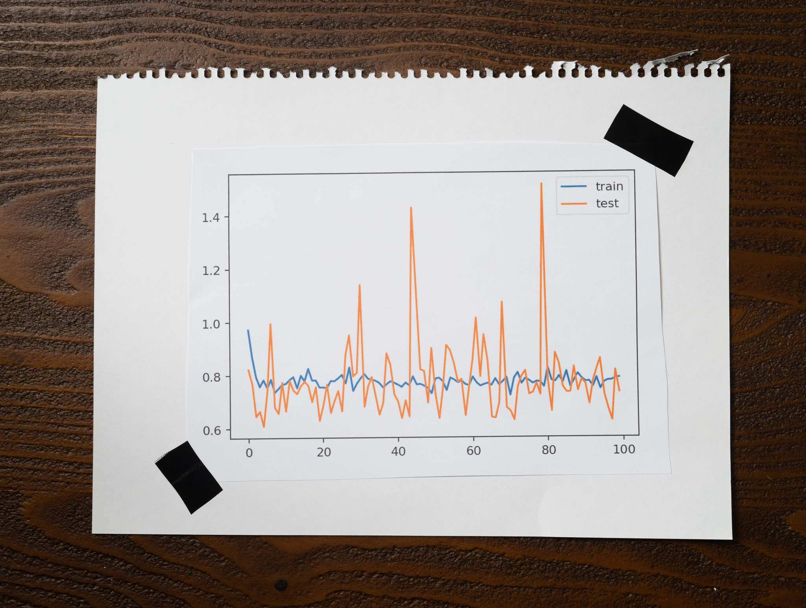

Lena ran two experiments training a neural network on a sample dataset. Her goal is to understand how different batch sizes affect the training process.

One of the experiments used a very small batch size, and the other used a batch size equal to all existing training data.

After training and evaluating her models, Lena plotted the training and testing losses over 100 epochs of one of the experiments, and this is what she got:

Which of the following options is the most likely to be true?

1. The model behind this plot corresponds to the experiment that used a very small batch size. This model was the one that took less time to train.

2. The model behind this plot corresponds to the experiment that used a very small batch size. This model was the one that took longer to train.

3. The model behind this plot corresponds to the experiment that used a batch size equal to all the available training data. This model was the one that took less time to train.

4. The model behind this plot corresponds to the experiment that used a batch size equal to all the available training data. This model was the one that took longer to train.

:::{.callout-note collapse="true" appearance="minimal"}
## Expand to see the answer

2

The amount of noise in the plot is crucial to answering this question.

The lower the batch size, the more noise we will get in the model's loss. When we only use a few samples, any instances that vary dramatically will cause the loss to swing wildly. When we use a larger batch, no individual sample would have the power to sway the loss too much, so we should expect less noise.

This plot shows a fair amount of noise, so this is likely the experiment that uses a small batch size.

The smaller the batch size, the more times we will need to compute the loss and update the model's weights during backpropagation. For example, if Lena's training set has 800 samples and uses one as her batch size, the algorithm will update the model's weights 800 times. However, if she uses a batch size of 32, the algorithm will update the model's weights 25 times (800 / 32 = 25.)

Updating the model during every iteration is computationally expensive, so using a smaller batch size will usually take longer. Therefore, the second option is probably the correct answer to this question.

**Recommended reading**

* ["The wrong batch size is all it takes"](https://articles.bnomial.com/the-wrong-batch-size-is-all-it-takes) explains how different batch sizes influence the training process of neural networks using gradient descent.
* Check ["An overview of gradient descent optimization algorithms"](https://ruder.io/optimizing-gradient-descent/index.html#gradientdescentvariants) for a deep dive into gradient descent and every one of its variants.
:::
