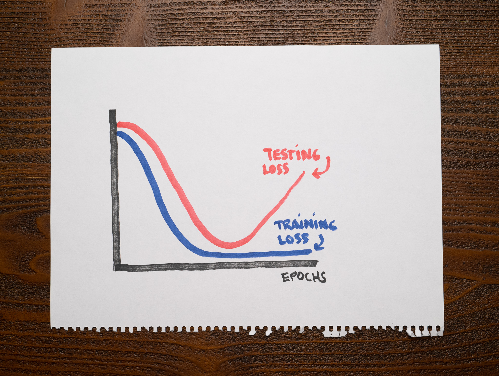

There's not a lot of context for you other than the following chart showing the training and testing losses of a machine learning model:

As you can see, the training loss is low after finishing training, but the testing loss stops decreasing at some point and starts climbing.

What's a reasonable conclusion about this machine learning model?

1. Your model is underfitting.

2. You are training a model for too many epochs.

3. Your model is well-fit to the point where the testing loss increases. It overfits after that.

4. Your model is well-fit to the point where the testing loss increases. It underfits after that.

:::{.callout-note collapse="true" appearance="minimal"}
## Expand to see the answer

2, 3

A good model should capture valuable patterns in the data and discard any noise that doesn't help with predictions. An overfitting model will fit that noise. An underfitting model will not capture the relevant patterns in the dataset.

An overfitting model should not have any problems with the training data but stumble with the testing data. Therefore, we should expect a low training loss and a high testing loss. An underfitting model should struggle with the training and testing datasets, so both of its losses should be high. A well-fit model, however, should have low training and testing losses.

A couple of things happen in this chart. First, up to the point the testing loss starts increasing, the model is well-fit. Then, the testing loss suddenly starts increasing, which means we trained the model for too long. Right when this happens, the model starts overfitting. It's memorizing the training data, it's not generalizing anymore.

A simple technique to fix this issue is [Early stopping.](https://articles.bnomial.com/early-stopping) In short, we want to stop training right before the model overfits.

**Recommended reading**

* Check ["Overfitting and Underfitting with Learning Curves"](https://articles.bnomial.com/overfitting-underfitting-learning-curves) for an introduction to two fundamental concepts in machine learning through the lens of learning curves.
* Check ["Early stopping"](https://articles.bnomial.com/early-stopping) for an introduction to one of the most effective, easy-to-implement regularization techniques when training machine learning models.
:::
